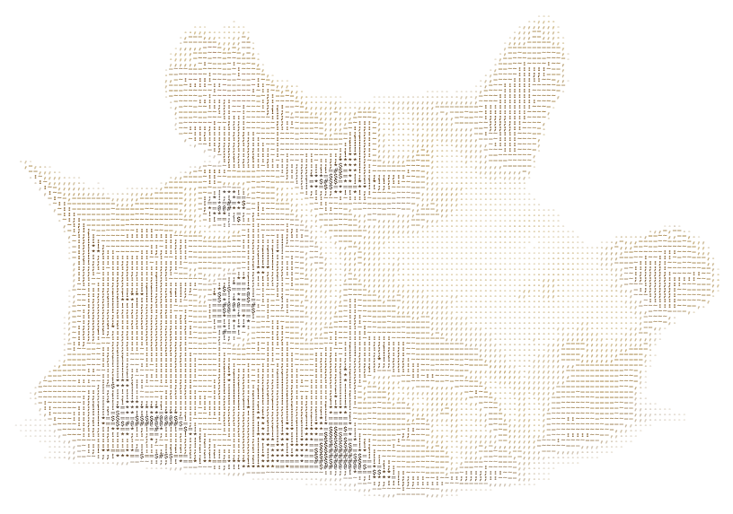

# asciiart-loader

Yet another loader for webpack.

The loader accepts pictures and converts them to HTML string.

Sometimes pictures won't load (and I'm not sure why - see [a problematic jpg in repo](test/cute-little-cat.jpg)), but _PNG_s should work.

For ASCII-fying I use a modified version of [jscii project](https://github.com/EnotionZ/jscii).

### Loader parameters:

* width: _Number_ = 150 - downscaled width in px and in characters
* color: _Boolean_ = false - if should colorify output?

Sample usage in an application with Webpack:

```javascript
var asciiCat = require('asciiart?color=1&width=100!./cat.jpg');
var pre = document.createElement('pre');
pre.innerHTML = asciiCat;
document.body.appendChild(pre);
```

### Sample input


### Sample output



### Contribution

It's a proof-of-concept for my talk on a conference.

Don't be shy to fork and hack this repo since I'm not planning to spend a lot of time on the maintenance.
